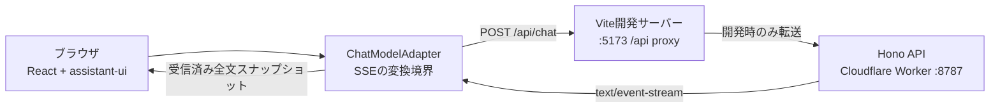

# アーキテクチャ

## 目的と範囲

このリポジトリは、assistant-uiのローカルランタイムと独自のSSEバックエンドを接続し、Markdownの長文が段階的に表示されるチャットUIを検証するためのサンドボックスである。

実際のLLMとの接続、認証、会話履歴の永続化などを備えた本番用チャットサービスではない。現在のサーバーはユーザー入力を受け取るものの内容を使用せず、常に固定のサンプルメッセージを返す。

## システム構成



### ワークスペース

| パス             | 責務                                                                 |
| ---------------- | -------------------------------------------------------------------- |
| `apps/website`   | React + assistant-uiによるチャットUI。SSEの受信と表示を担当する      |
| `apps/server`    | Hono + Cloudflare WorkersによるHTTP API。固定メッセージをSSE配信する |
| `packages/utils` | 将来の共通ユーティリティ置き場。現在はどのアプリからも使用していない |

UIコンポーネントはassistant-uiのレジストリから`apps/website/src/components/`へコピーし、このリポジトリで所有する。スタイリングにはTailwind CSS v4を使用する。

### 主なエントリーポイント

| パス                                                  | 役割                                                 |
| ----------------------------------------------------- | ---------------------------------------------------- |
| `apps/website/src/main.tsx`                           | ReactアプリをDOMへマウントする                       |
| `apps/website/src/App.tsx`                            | `useLocalRuntime`を生成し、UIへ提供する              |
| `apps/website/src/chat-model-adapter.ts`              | assistant-uiと独自SSEプロトコルを相互変換する        |
| `apps/website/src/components/assistant-ui/thread.tsx` | メッセージ一覧、入力欄、各メッセージの表示を構成する |
| `apps/server/src/index.ts`                            | HonoアプリとHTTPエンドポイントを定義する             |
| `apps/server/src/sample-message.ts`                   | 固定応答と、そのチャンク分割処理を定義する           |

## 実行構成

### 開発時

`vp run dev`はWebsiteとServerを並行起動する。

- Website: `http://localhost:5173`
- Server: `http://localhost:8787`
- WebsiteのVite開発サーバーは`/api`をServerへプロキシする

ブラウザは常に相対URLの`/api/chat`へアクセスするため、開発時にCORS設定は不要である。

### ビルドと本番環境

Websiteは静的アセットとして、ServerはCloudflare Workerとしてそれぞれビルドされる。ServerのWorker設定は`apps/server/wrangler.jsonc`、ビルド統合は`@cloudflare/vite-plugin`が担当する。

本番環境のホスティング先、デプロイ手順、および同一オリジンで`/api/*`をWorkerへ振り分ける方法は、現在のリポジトリでは定義していない。Websiteは相対URLでAPIを呼ぶため、本番化する際は配信基盤側でこのルーティングを用意するか、クライアントのAPI URL設定を追加する必要がある。

## 通信フロー

1. ユーザーが`Thread`のComposerからメッセージを送信する。
2. `useLocalRuntime`がメッセージをローカル状態へ追加し、`ChatModelAdapter.run`を呼び出す。
3. Adapterが現在のメッセージ配列を`{ messages }`として`POST /api/chat`へ送信する。
4. 開発時はWebsiteのVite開発サーバーがリクエストをServerの`:8787`へ転送する。
5. ServerはリクエストJSONを読み捨て、固定Markdownを10〜20文字程度のチャンクに分割する。
6. Serverは各チャンクをSSEの`message`イベントとして配信し、最後に`done`イベントを送ってストリームを閉じる。
7. Adapterは`eventsource-parser/stream`でイベントを読み、受信した`delta`を連結する。
8. Adapterはチャンクごとの差分ではなく、その時点の全文をassistant-uiへ返す。これは`ChatModelAdapter`がメッセージ内容のスナップショットを受け取る契約だからである。
9. assistant-uiが状態を更新し、`@assistant-ui/react-markdown`がアシスタントメッセージをMarkdownとして表示する。

## HTTP・SSE契約

### `GET /api/health`

Serverの起動確認用エンドポイント。

```json
{ "status": "ok" }
```

### `POST /api/chat`

リクエストの概形は次のとおり。`messages`の要素はassistant-uiのメッセージ形式に従う。

```json
{
  "messages": []
}
```

現在のServerはリクエスト内容を使用せず、JSONの形式検証も行わない。JSONの読み取りに失敗した場合も固定応答の配信を続ける。

レスポンスのContent-Typeは`text/event-stream`で、次のイベントを順に返す。

| event     | data              | 意味                               |
| --------- | ----------------- | ---------------------------------- |
| `message` | `{"delta":"..."}` | 固定応答の差分チャンク。複数回届く |
| `done`    | `{}`              | 正常終了。必ず最後に1回送る        |

Serverが送る`delta`と、Adapterがassistant-uiへ渡す値の意味は異なる。Adapterはすべての`delta`を連結し、毎回`[{ "type": "text", "text": "受信済みの全文" }]`相当のスナップショットを返す。

独自のSSEエラーイベント、再接続ID、リトライ指示、ハートビートは現時点では定義していない。

## 責務の境界

| レイヤー                         | 管理するもの                                                      | 管理しないもの                               |
| -------------------------------- | ----------------------------------------------------------------- | -------------------------------------------- |
| assistant-ui / `useLocalRuntime` | メッセージ状態、生成中状態、Composer、キャンセル操作、表示更新    | 通信プロトコル、サーバーの応答生成           |
| `ChatModelAdapter`               | HTTPリクエスト、SSEのパース、差分の連結、assistant-ui形式への変換 | 会話の永続化、応答内容の生成                 |
| Hono Server                      | HTTPエンドポイント、SSEイベント、固定応答のチャンク配信           | UI状態、メッセージ履歴、入力に基づく応答生成 |
| Vite proxy                       | 開発時の`/api`転送                                                | 本番環境のルーティング                       |

## 状態とライフサイクル

会話とComposerの状態は`useLocalRuntime`がブラウザのメモリ上で管理する。永続ストレージやServer側のセッションには接続していない。

- ページを再読み込みすると会話履歴は失われる
- Serverは過去の会話を保持しない
- リクエストにはその時点のメッセージ配列全体を含めるが、Serverは読み捨てる
- 永続的なスレッド一覧や、端末間での履歴同期は提供しない
- 応答中は同じスレッドで新しい送信を開始せず、UIは停止操作を表示する

## キャンセルとエラー

生成停止時はassistant-uiから渡された`AbortSignal`で`fetch`を中断する。Adapterは`AbortError`を正常なキャンセルとして扱い、それ以外のネットワークエラー、SSEの読み取りエラー、JSONパースエラーは上位へ送出する。UIはassistant-uiのメッセージエラー表示を使用する。

現状には次の制約がある。

- AdapterはHTTPステータスを明示的に検査していない
- レスポンスBodyが存在することを前提としている
- Server側に明示的なキャンセル処理はなく、クライアントがストリームの読み取りを停止するだけである
- エラー形式をクライアントとServer間で共通化していない

## テスト方針

Serverには次の自動テストがある。

- `GET /api/health`のステータス、Content-Type、JSON本文
- `POST /api/chat`が複数の`message`イベントと最後の`done`イベントを返すこと
- すべての`delta`を連結すると固定サンプル全文に一致すること
- チャンク分割後も元の文字列が保存され、指定した長さの範囲に収まること

Websiteのコンポーネントテスト、ブラウザE2Eテスト、WebsiteとServerを同時に起動する結合テストはまだない。そのため、UIレイアウト、Composer操作、キャンセル、プロキシを含む一連の動作は現在の自動テストでは保証していない。

リポジトリ全体のチェック、テスト、ビルドは`vp run ready`で実行する。

## 制約と非目標

現時点では以下を対象外とする。

- LLMや外部AI APIとの接続
- ユーザー入力に応じた応答生成
- 認証、認可、ユーザー管理
- 会話履歴の永続化と検索
- リクエスト検証、レート制限、利用量制御
- ファイル添付内容のServer側での処理
- 本番デプロイと監視・ログ設計
- SSEの再接続、再開、エラー回復プロトコル

## 設計判断

主要な設計判断の背景・選択肢・理由は[ADR](adr/)を参照する。アーキテクチャを変更する際、将来も維持すべき判断はADRとして追加する。
